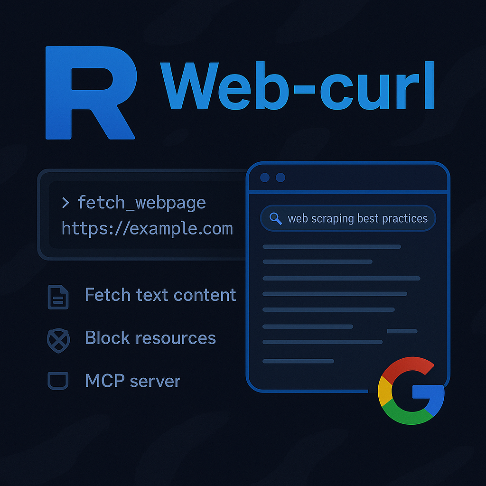
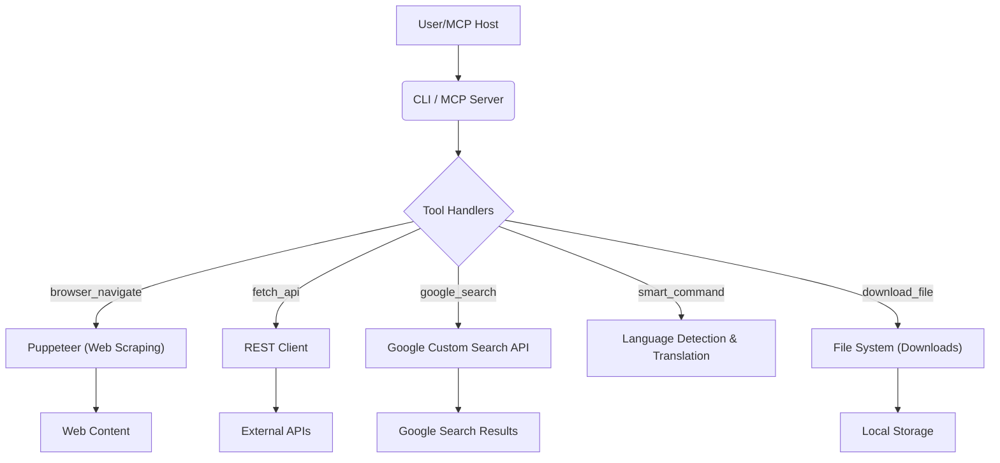

### Google Custom Search API

Google Custom Search API is free with usage limits (e.g., 100 queries per day for free, with additional queries requiring payment). For full details on quotas, pricing, and restrictions, see the [official documentation](https://developers.google.com/custom-search/v1/overview).

# Web-curl

<div align="center">



</div>

**Developed by Rayss**

> 🚀 **Open Source Project**  
> 🛠️ Built with Node.js & TypeScript (Node.js v18+ required)

---

<div align="center">

[](https://nodejs.org/)
[](LICENSE)


</div>

---

<div align="center">
  <a href="https://glama.ai/mcp/servers/@rayss868/MCP-Web-Curl">
    
  </a>
</div>

---

## 🎬 Demo Video

[](demo/demo_1.mp4)

> [Click here to watch the demo video directly in your browser.](demo/demo_1.mp4)

If your platform supports it, you can also [download and play demo/demo_1.mp4](demo/demo_1.mp4) directly.

<div align="center">

<video width="640" height="360" controls autoplay>
  <source src="demo/demo_1.mp4" type="video/mp4">
  Your browser does not support the video tag.
</video>

</div>

---

## 📚 Table of Contents

- [Changelog / Update History](#changelog)
- [Overview](#overview)
- [Features](#features)
- [Architecture](#architecture)
- [Installation](#installation)
- [Usage](#usage)
- [CLI Usage](#cli-usage)
- [MCP Server Usage](#mcp-server-usage)
- [Configuration](#configuration)
- [Examples](#examples)
- [Troubleshooting](#troubleshooting)
- [Tips & Best Practices](#tips--best-practices)
- [Contributing & Issues](#contributing--issues)
- [License & Attribution](#license--attribution)

---

<a name="changelog"></a>
## 📝 Changelog / Update History

See [CHANGELOG.md](CHANGELOG.md) for a complete history of updates and new features.

<a name="overview"></a>
## 📝 Overview

**Web-curl** is a powerful tool for fetching and extracting text content from web pages and APIs. Use it as a standalone CLI or as an MCP (Model Context Protocol) server. Web-curl leverages Puppeteer for robust web scraping and supports advanced features such as resource blocking, custom headers, authentication, and Google Custom Search.

---
<a name="features"></a>

## ✨ Features

### 🚀 Deep Research & Automation (v1.4.2)

- **Advanced Browser Automation**: Full control over Chromium via Puppeteer (click, type, scroll, hover, key presses).
- **Always-On Session Persistence**: Browser profiles are now always persistent. Login sessions, cookies, and cache are automatically saved in a local `user_data/` directory.
- **Multi-Tab Research**: Manage up to 10 concurrent tabs with automatic rotation. Open multiple pages or perform parallel searches to gather information faster.
- **Token-Efficient Snapshots**:
    - **Accessibility Tree**: Clean, structured snapshots instead of messy HTML.
    - **HTML Slice Mode**: Raw HTML with `startIndex`/`endIndex` for safe chunking when needed.
    - **Viewport Filtering**: Automatically filters out elements not visible on screen, saving up to 90% of context tokens on long pages.
- **Chrome DevTools Integration**:
    - **Network Monitoring**: Capture XHR/Fetch requests to see data flowing behind the scenes.
    - **Console Logs**: Access browser console output for debugging or data extraction.
    - **Browser Configuration**: Set custom User-Agents, Proxies, and Viewport sizes.
- **Parallel Batch Operations**:
    - `multi_search`: Run multiple Google searches at once.
    - `batch_navigate`: Open and load multiple websites in parallel.
- **Intelligent Resource Management**:
    - **Idle Auto-Close**: Browser automatically shuts down after 15 minutes of inactivity to save RAM/CPU.
    - **Tab Rotation**: Automatically replaces the oldest tab when the 10-tab limit is reached.
- **Media & Documents**:
    - **Full-Page Screenshots**: Capture high-quality screenshots with a 5-day auto-cleanup lifecycle and custom destination support.
    - **Document Parsing**: Extract text from PDF and DOCX files directly from URLs.

### Storage & Download Details

- 🗂️ Error log rotation: `logs/error-log.txt` is rotated when it exceeds ~1MB (renamed to `error-log.txt.bak`) to prevent unbounded growth.
- 🧹 Logs & temp cleanup: old temporary files in the `logs/` directory are cleaned up at startup.
- 🛑 Browser lifecycle: Puppeteer browser instances are closed in finally blocks to avoid Chromium temp file leaks.
- 🔎 Content extraction:
  - Returns raw text, HTML, and Readability "main article" when available. Readability attempts to extract the primary content of a webpage, removing headers, footers, sidebars, and other non-essential elements, providing a cleaner, more focused text.
  - Readability output is subject to `startIndex`/`maxLength`/`chunkSize` slicing when requested.
- 🚫 Resource blocking: `blockResources` is now always forced to `false`, meaning resources are never blocked for faster page loads.
- ⏱️ Timeout control: navigation and API request timeouts are configurable via tool arguments.
- 💾 Output: results can be printed to stdout or written to a file via CLI options.
- ⬇️ Download behavior (`download_file`):
  - `destinationFolder` accepts relative paths (resolved against the project root) or absolute paths.
  - The server creates `destinationFolder` if it does not exist.
  - Downloads are streamed using Node streams + `pipeline` to minimize memory use and ensure robust writes.
  - Filenames are derived from the URL path (e.g., `https://.../path/file.jpg` -> `file.jpg`). If no filename is present, the fallback name is `downloaded_file`.
  - Overwrite semantics: by default the implementation will overwrite an existing file with the same name.
- 🖥️ Usage modes: CLI and MCP server (stdin/stdout transport).
- 🌐 REST client: `fetch_api` returns JSON/text when appropriate and base64 for binary responses.
- 🔍 Google Custom Search: requires `APIKEY_GOOGLE_SEARCH` and `CX_GOOGLE_SEARCH`.
- 🤖 Smart command:
  - Auto language detection (franc-min) and optional translation (dynamic `translate` import).
  - Query enrichment is heuristic-based; results depend on the detected intent.

---

<a name="architecture"></a>
## 🏗️ Architecture

This section outlines the high-level architecture of Web-curl.


*   **CLI & MCP Server**: [`src/index.ts`](src/index.ts)
    Implements both the CLI entry point and the MCP server.
*   **Web Scraping**: Uses Puppeteer for headless browsing and content extraction.
*   **REST Client**: [`src/rest-client.ts`](src/rest-client.ts)
    Provides a flexible HTTP client for API requests.

---
<a name="installation"></a>

## ⚙️ MCP Server Configuration Example

To integrate web-curl as an MCP server, add the following configuration to your `mcp_settings.json`:

```json
{
  "mcpServers": {
    "web-curl": {
      "command": "node",
      "args": [
        "build/index.js"
      ],
      "disabled": false,
      "alwaysAllow": [
        "browser_navigate",
        "browser_snapshot",
        "browser_action",
        "browser_tabs",
        "batch_navigate",
        "multi_search",
        "browser_network_requests",
        "browser_console_messages",
        "browser_configure",
        "browser_links",
        "take_screenshot",
        "parse_document",
        "browser_close",
        "google_search",
        "fetch_api",
        "smart_command",
        "download_file",
        "fetch_webpage"
      ],
      "env": {
        "APIKEY_GOOGLE_SEARCH": "YOUR_GOOGLE_API_KEY",
        "CX_GOOGLE_SEARCH": "YOUR_CX_ID"
      }
    }
  }
}
```

---

### 🔑 How to Obtain Google API Key and CX

1.  **Get a Google API Key:**
    - Go to [Google Cloud Console](https://console.cloud.google.com/).
    - Create/select a project, then go to **APIs & Services > Credentials**.
    - Click **Create Credentials > API key** and copy it.
2.  **Get a Custom Search Engine (CX) ID:**
    - Go to [Google Custom Search Engine](https://cse.google.com/cse/all).
    - Create/select a search engine, then copy the **Search engine ID** (CX).
3.  **Enable Custom Search API:**
    - In Google Cloud Console, go to **APIs & Services > Library**.
    - Search for **Custom Search API** and enable it.

Replace `YOUR_GOOGLE_API_KEY` and `YOUR_CX_ID` in the config above.

---

<a name="installation"></a>
## 🛠️ Installation

```bash
# Clone the repository
git clone https://github.com/rayss868/MCP-Web-Curl
cd web-curl

# Install dependencies
npm install

# Build the project
npm run build
```
*   **Prerequisites**: Ensure you have Node.js (v18+) and Git installed on your system.

### Puppeteer installation notes

- **Windows:** Just run `npm install`.
- **Linux / Ubuntu Server:** You must install extra dependencies for Chromium to handle rendering and screenshots in a headless environment. Run:

  ```bash
  sudo apt-get update && sudo apt-get install -y \
    fonts-liberation \
    libasound2 \
    libatk-bridge2.0-0 \
    libatk1.0-0 \
    libc6 \
    libcairo2 \
    libcups2 \
    libdbus-1-3 \
    libexpat1 \
    libfontconfig1 \
    libgbm1 \
    libgcc1 \
    libglib2.0-0 \
    libgtk-3-0 \
    libnspr4 \
    libnss3 \
    libpango-1-0-0 \
    libpangocairo-1.0-0 \
    libstdc++6 \
    libx11-6 \
    libx11-xcb1 \
    libxcb1 \
    libxcomposite1 \
    libxcursor1 \
    libxdamage1 \
    libxext6 \
    libxfixes3 \
    libxi6 \
    libxrandr2 \
    libxrender1 \
    libxss1 \
    libxtst6 \
    lsb-release \
    wget \
    xdg-utils
  ```

For more details, see the [Puppeteer troubleshooting guide](https://pptr.dev/troubleshooting).

---

<a name="usage"></a>
## 🚀 Usage

### CLI Usage

The CLI supports fetching and extracting text content from web pages.

```bash
# Basic usage
node build/index.js https://example.com

# With options
node build/index.js --timeout 30000 https://example.com

# Save output to a file
node build/index.js -o result.json https://example.com
```

#### Command Line Options

- `--timeout <ms>`: Set navigation timeout (default: 60000)
- `-o <file>`: Output result to specified file

### MCP Server Usage

Web-curl can be run as an MCP server for integration with Roo Context or other MCP-compatible environments.

#### Exposed Tools (v1.4.2)

- **browser_flow**: One-call workflow (optional navigate → optional actions → return snapshot/screenshot/links/console/network). Use this to avoid calling many tools.
- **browser_navigate**: Open a URL in the active tab (includes network-idle wait + short stabilization).
- **browser_snapshot**: TEXT snapshot (tree by default, or `mode: "html"` slices with `startIndex`/`endIndex`).
- **browser_action**: Interact with the page (click/type/scroll/hover/press_key/waitForSelector). Best used with `ref:` from snapshot.
- **browser_tabs**: List, create, close, or select tabs (max 10).
- **batch_navigate**: Open many URLs (each in a new tab) and return tab indexes.
- **multi_search**: Run multiple Google searches in parallel.
- **browser_network_requests**: Recent network requests.
- **browser_console_messages**: Recent console logs/warnings/errors.
- **browser_configure**: Set proxy/user-agent/viewport (session persistence is always on via `user_data/`).
- **browser_links**: Extract all valid links from the page.
- **take_screenshot**: PNG screenshot to disk. Default `fullPage: true` (set `false` for faster viewport-only).
- **parse_document**: Extract text from PDF/DOCX URLs.
- **browser_close**: Close browser and tabs.
- **google_search**: Google Custom Search (single query).
- **fetch_api**: REST API request with response truncation (`limit`).
- **smart_command**: Natural-language search command (auto language detect + translate + query enrichment).
- **download_file**: Download a file from a URL.

#### Running as MCP Server

```bash
npm run start
```

The server will communicate via stdin/stdout and expose the tools as defined in [`src/index.ts`](src/index.ts).

---

### 🚦 HTML Slicing Example (Recommended for Large Pages)

Use [`browser_snapshot`](src/index.ts:469) with `mode: "html"` when you need raw HTML but want to keep the response small.

Client request for first slice:
```json
{
  "name": "browser_snapshot",
  "arguments": {
    "mode": "html",
    "startIndex": 0,
    "endIndex": 20000
  }
}
```

Response (example):
```json
{
  "mode": "html",
  "totalLength": 123456,
  "startIndex": 0,
  "endIndex": 20000,
  "remainingCharacters": 103456,
  "content": "<html>...first slice...</html>"
}
```

---

<a name="configuration"></a>
## 🧩 Configuration

- **Session Persistence**: Always enabled. Logins and cookies are automatically reused across restarts.
- **Timeout**: Set navigation and API request timeouts.
- **Environment Variables**: Used for Google Search API integration.

---

## 💡 Examples {#examples}

<details>
<summary>Make a REST API Request</summary>

```json
{
  "name": "fetch_api",
  "arguments": {
    "url": "https://api.github.com/repos/nodejs/node",
    "method": "GET",
    "headers": {
      "Accept": "application/vnd.github.v3+json"
    },
    "limit": 10000
  }
}
```
</details>

<details>
<summary>Download File</summary>

```json
{
  "name": "download_file",
  "arguments": {
    "url": "https://example.com/image.jpg",
    "destinationFolder": "downloads"
  }
}
```

Note: `destinationFolder` can be either a relative path (resolved against the project root) or an absolute path. The server will create the destination folder if it does not exist.
</details>

<details>
<summary>Configure Browser</summary>

```json
{
  "name": "browser_configure",
  "arguments": {
    "proxy": "http://proxy.example.com:8080",
    "viewport": { "width": 1920, "height": 1080 }
  }
}
```

Note: Session persistence is always enabled. Cookies and login sessions are automatically stored in the `user_data/` directory.
</details>

---
## 🛠️ Troubleshooting {#troubleshooting}

- **Timeout Errors**: Increase the `timeout` parameter if requests are timing out.
- **Google Search Fails**: Ensure `APIKEY_GOOGLE_SEARCH` and `CX_GOOGLE_SEARCH` are set in your environment.
- **Error Logs**: Check the `logs/error-log.txt` file for detailed error messages.

---

## 🧠 Tips & Best Practices {#tips--best-practices}

<details>
<summary>Click for advanced tips</summary>

- For large pages, use `maxLength` and `startIndex` to fetch content in slices.
- Always validate your tool arguments to avoid errors.
- Secure your API keys and sensitive data using environment variables.
- Review the MCP tool schemas in [`src/index.ts`](src/index.ts) for all available options.

</details>

---

## 🤝 Contributing & Issues {#contributing--issues}

Contributions are welcome! If you want to contribute, fork this repository and submit a pull request.  
If you find any issues or have suggestions, please open an issue on the repository page.

---

## 📄 License & Attribution {#license--attribution}

This project was developed by **Rayss**.  
For questions, improvements, or contributions, please contact the author or open an issue in the repository.

---
> **Note:** Google Search API is free with usage limits. For details, see: [Google Custom Search API Overview](https://developers.google.com/custom-search/v1/overview)
