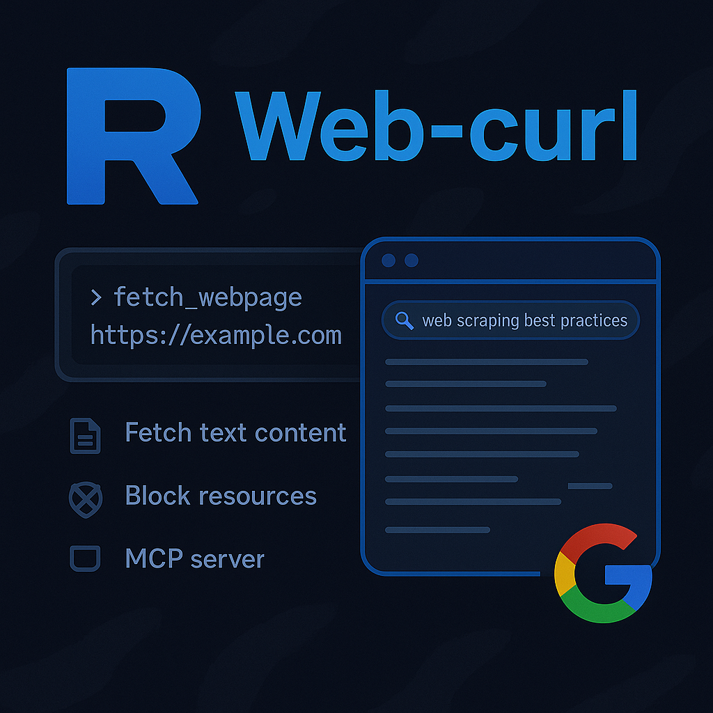
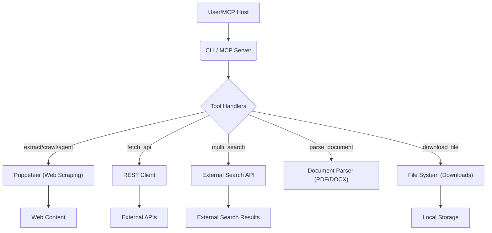

# Web-curl

<div align="center">



</div>

**Developed by Rayss**

> 🚀 **Open Source Project**  
> 🛠️ Built with Node.js & TypeScript (Node.js v18+ required)

---

<div align="center">

[](https://nodejs.org/)
[](LICENSE)


</div>

---

<div align="center">
  <a href="https://glama.ai/mcp/servers/@rayss868/MCP-Web-Curl">
    
  </a>
</div>

---

## 🎬 Demo Video

[](demo/demo.mp4)

> [Click here to watch the demo video directly in your browser.](demo/demo.mp4)

If your platform supports it, you can also [download and play demo/demo.mp4](demo/demo.mp4) directly.

<div align="center">

<video width="640" height="360" controls autoplay>
  <source src="demo/demo.mp4" type="video/mp4">
  Your browser does not support the video tag.
</video>

</div>

---

## 📚 Table of Contents

- [Changelog / Update History](#changelog)
- [Overview](#overview)
- [Features](#features)
- [Architecture](#architecture)
- [Installation](#installation)
- [Usage](#usage)
- [CLI Usage](#cli-usage)
- [MCP Server Usage](#mcp-server-usage)
- [Configuration](#configuration)
- [Examples](#examples)
- [Troubleshooting](#troubleshooting)
- [Tips & Best Practices](#tips--best-practices)
- [Contributing & Issues](#contributing--issues)
- [Academic Publication](#academic-publication)
- [License & Attribution](#license--attribution)

---

<a name="changelog"></a>
## 📝 Changelog / Update History

See [CHANGELOG.md](CHANGELOG.md) for a complete history of updates and new features.

<a name="overview"></a>
## 📝 Overview

**Web-curl** is a powerful tool for fetching and extracting text content from web pages and APIs. Use it as a standalone CLI or as an MCP (Model Context Protocol) server. Web-curl leverages Puppeteer for robust web scraping and supports advanced features such as resource blocking, custom headers, authentication, and External Search API integration.

---
<a name="features"></a>

## ✨ Features

### 🚀 Deep Research & Automation (v1.4.2)

- **Advanced Browser Automation**: Full control over Chromium via Puppeteer (click, type, scroll, hover, key presses).
- **Always-On Session Persistence**: Browser profiles are now always persistent. Login sessions, cookies, and cache are automatically saved in a local `user_data/` directory.
- **Token-Efficient Snapshots** (available via the hidden `browser_snapshot` handler):
    - **Accessibility Tree**: Clean, structured snapshots instead of messy HTML.
    - **HTML Slice Mode**: Raw HTML with `startIndex`/`endIndex` for safe chunking when needed.
- **Chrome DevTools Integration (implemented, but hidden from `list_tools`)**:
    - Network Monitoring (`browser_network_requests`)
    - Console Logs (`browser_console_messages`)
- **External Search API**:
    - `multi_search`: Run multiple queries in parallel using one configured external search API.
- **Intelligent Resource Management**:
    - **Idle Auto-Close**: Browser automatically shuts down after 15 minutes of inactivity to save RAM/CPU.
    - **Tab Rotation**: Automatically replaces the oldest tab when the 10-tab limit is reached.
- **Media & Documents**:
    - **Full-Page Screenshots**: Capture high-quality screenshots with a 5-day auto-cleanup lifecycle and custom destination support.
    - **Document Parsing**: Extract text from PDF and DOCX files directly from URLs.

### Storage & Download Details

- 🗂️ Error log rotation: `logs/error-log.txt` is rotated when it exceeds ~1MB (renamed to `error-log.txt.bak`) to prevent unbounded growth.
- 🧹 Logs & temp cleanup: old temporary files in the `logs/` directory are cleaned up at startup.
- 🛑 Browser lifecycle: Puppeteer browser instances are closed in finally blocks to avoid Chromium temp file leaks.
- 🔎 Content extraction:
  - Returns raw text, HTML, and Readability "main article" when available. Readability attempts to extract the primary content of a webpage, removing headers, footers, sidebars, and other non-essential elements, providing a cleaner, more focused text.
  - Readability output is subject to `startIndex`/`maxLength`/`chunkSize` slicing when requested.
- ⏱️ Timeout control: navigation and API request timeouts are configurable via tool arguments.
- 💾 Output: results can be printed to stdout or written to a file via CLI options.
- ⬇️ Download behavior (`download_file`):
  - `destinationFolder` accepts relative paths (resolved against the project root) or absolute paths.
  - The server creates `destinationFolder` if it does not exist.
  - Downloads are streamed using Node streams + `pipeline` to minimize memory use and ensure robust writes.
  - Filenames are derived from the URL path (e.g., `https://.../path/file.jpg` -> `file.jpg`). If no filename is present, the fallback name is `downloaded_file`.
  - Overwrite semantics: by default the implementation will overwrite an existing file with the same name.
- 🖥️ Usage modes: CLI and MCP server (stdin/stdout transport).
- 🌐 REST client: `fetch_api` returns JSON/text when appropriate and base64 for binary responses.
- 🔍 Search uses one backend at a time: External API by default, or optional Google Custom Search with `SEARCH_PROVIDER=google`.
- 🤖 Smart command:
  - Auto language detection (franc-min) and optional translation (dynamic `translate` import).
  - Query enrichment is heuristic-based; results depend on the detected intent.

---

<a name="architecture"></a>
## 🏗️ Architecture

This section outlines the high-level architecture of Web-curl.


```mermaid
graph TD
    A[User/MCP Host] --> B(CLI / MCP Server)
    B --> C{Tool Handlers}
    C -- extract/crawl/agent --> D["Puppeteer (Web Scraping)"]
    C -- fetch_api --> E["REST Client"]
    C -- multi_search --> F["External Search API"]
    C -- parse_document --> G["Document Parser (PDF/DOCX)"]
    C -- download_file --> H["File System (Downloads)"]
    D --> I["Web Content"]
    E --> J["External APIs"]
    F --> K["External Search Results"]
    H --> L["Local Storage"]
```
*   **CLI & MCP Server**: [`src/index.ts`](src/index.ts)
    Implements both the CLI entry point and the MCP server.
*   **Web Scraping**: Uses Puppeteer for headless browsing and content extraction.
*   **REST Client**: [`src/rest-client.ts`](src/rest-client.ts)
    Provides a flexible HTTP client for API requests.

---
<a name="installation"></a>

## ⚙️ MCP Server Configuration Example

To integrate web-curl as an MCP server, add the following configuration to your `mcp_settings.json`:

```json
{
  "mcpServers": {
    "web-curl": {
      "command": "node",
      "args": [
        "build/index.js"
      ],
      "disabled": false,
      "alwaysAllow": [
        "extract",
        "crawl",
        "agent",
        "research",
        "browser_configure",
        "browser_close",
        "multi_search",
        "fetch_api",
        "download_file",
        "parse_document"
      ],
      "env": {
        "SEARCH_PROVIDER": "external",
        "SEARCH_BASE_URL": "https://example.com/v1/search",
        "SEARCH_MODEL": "search-combo",
        "SEARCH_API_KEY": "YOUR_EXTERNAL_SEARCH_API_KEY",
        "APIKEY_GOOGLE_SEARCH": "YOUR_GOOGLE_API_KEY",
        "CX_GOOGLE_SEARCH": "YOUR_CX_ID"
      }
    }
  }
}
```

---

### 🔑 Configure the External Search API

Search uses one backend per request; it does not cascade or fall back. By default, set `SEARCH_PROVIDER=external`, `SEARCH_BASE_URL` to the endpoint (for example, `https://example.com/v1/search`), `SEARCH_MODEL` to the model/provider identifier accepted there (for example, `search-combo`), and `SEARCH_API_KEY` to the API key. To use Google Custom Search instead, set `SEARCH_PROVIDER=google` and configure `APIKEY_GOOGLE_SEARCH` plus `CX_GOOGLE_SEARCH`.

---

<a name="installation"></a>
## 🛠️ Installation

```bash
# Clone the repository
git clone https://github.com/rayss868/MCP-Web-Curl
cd web-curl

# Install dependencies
npm install

# Build the project
npm run build
```
*   **Prerequisites**: Ensure you have Node.js (v18+) and Git installed on your system.

### Puppeteer installation notes

- **Windows:** Just run `npm install`.
- **Linux / Ubuntu Server:** You must install extra dependencies for Chromium to handle rendering and screenshots in a headless environment. Run:

  ```bash
  sudo apt-get update && sudo apt-get install -y \
    fonts-liberation \
    libasound2 \
    libatk-bridge2.0-0 \
    libatk1.0-0 \
    libc6 \
    libcairo2 \
    libcups2 \
    libdbus-1-3 \
    libexpat1 \
    libfontconfig1 \
    libgbm1 \
    libgcc1 \
    libglib2.0-0 \
    libgtk-3-0 \
    libnspr4 \
    libnss3 \
    libpango-1-0-0 \
    libpangocairo-1.0-0 \
    libstdc++6 \
    libx11-6 \
    libx11-xcb1 \
    libxcb1 \
    libxcomposite1 \
    libxcursor1 \
    libxdamage1 \
    libxext6 \
    libxfixes3 \
    libxi6 \
    libxrandr2 \
    libxrender1 \
    libxss1 \
    libxtst6 \
    lsb-release \
    wget \
    xdg-utils
  ```

For more details, see the [Puppeteer troubleshooting guide](https://pptr.dev/troubleshooting).

---

<a name="usage"></a>
## 🚀 Usage

### CLI Usage

The CLI supports fetching and extracting text content from web pages.

```bash
# Basic usage
node build/index.js https://example.com

# With options
node build/index.js --timeout 30000 https://example.com

# Save output to a file
node build/index.js -o result.json https://example.com
```

#### Command Line Options

- `--timeout <ms>`: Set navigation timeout (default: 60000)
- `-o <file>`: Output result to specified file

### MCP Server Usage

Web-curl can be run as an MCP server for integration with Roo Context or other MCP-compatible environments.

#### Exposed Tools (v1.4.2)

Only the tools below are exposed via `list_tools` to reduce tool-chaining in agent clients.

- **browser_configure**: Set proxy/user-agent/viewport (session persistence is always on via `user_data/`).
- **browser_close**: Close browser and tabs (also auto-closes after 15 minutes of inactivity).
- **multi_search**: Run multiple searches in parallel using the selected search backend.
- **fetch_api**: REST API request with response truncation (`limit`).
- **download_file**: Download a file from a URL.
- **parse_document**: Extract text from PDF/DOCX URLs.
- **research**: Decompose a question into sub-queries, search in parallel, and return a cited markdown report.
- **extract**: Pull structured fields from a page via CSS selectors, tables, meta tags, JSON-LD, or Readability. Non-HTML responses (plain text, JSON, source files) come back as raw text in `mainContent` with `isHtml: false`.
- **crawl**: Traverse a site (BFS/DFS/sitemap/link-map) with include/exclude filters and a politeness delay.
- **agent**: Collect flat records from many pages using a field schema (CSS selectors and/or JSON-LD paths).

Lower-level browser tools still have handlers in `CallToolRequestSchema` but are intentionally not exposed.

#### Running as MCP Server

```bash
npm run start
```

The server will communicate via stdin/stdout and expose the tools as defined in [`src/index.ts`](src/index.ts).

---

### 🚦 Keeping Responses Small (Recommended for Large Pages)

Use [`extract`](src/index.ts:460) with `maxTextChars` to cap the main-content text, and turn off the extra
extractors you do not need. This keeps large pages from flooding the context.

Client request for a trimmed extraction:
```json
{
  "name": "extract",
  "arguments": {
    "url": "https://example.com/article",
    "includeTables": false,
    "includeJsonLd": false,
    "includeMeta": false,
    "maxTextChars": 20000
  }
}
```

Response (example):
```json
{
  "url": "https://example.com/article",
  "title": "Example Article",
  "mainContent": "The first 20000 characters of readable text...",
  "truncated": true
}
```

---

<a name="configuration"></a>
## 🧩 Configuration

- **Session Persistence**: Always enabled. Logins and cookies are automatically reused across restarts.
- **Timeout**: Set navigation and API request timeouts.
- **Environment Variables**: Used for the selected search backend (`external` by default, or optional `google`).

---

## 💡 Examples {#examples}

<details>
<summary>Make a REST API Request</summary>

```json
{
  "name": "fetch_api",
  "arguments": {
    "url": "https://api.github.com/repos/nodejs/node",
    "method": "GET",
    "headers": {
      "Accept": "application/vnd.github.v3+json"
    },
    "limit": 10000
  }
}
```
</details>

<details>
<summary>Download File</summary>

```json
{
  "name": "download_file",
  "arguments": {
    "url": "https://example.com/image.jpg",
    "destinationFolder": "downloads"
  }
}
```

Note: `destinationFolder` can be either a relative path (resolved against the project root) or an absolute path. The server will create the destination folder if it does not exist.
</details>

<details>
<summary>Configure Browser</summary>

```json
{
  "name": "browser_configure",
  "arguments": {
    "proxy": "http://proxy.example.com:8080",
    "viewport": { "width": 1920, "height": 1080 }
  }
}
```

Note: Session persistence is always enabled. Cookies and login sessions are automatically stored in the `user_data/` directory.
</details>

---
## 🛠️ Troubleshooting {#troubleshooting}

- **Timeout Errors**: Increase the `timeout` parameter if requests are timing out.
- **External Search Fails**: Ensure `SEARCH_PROVIDER=external` and `SEARCH_BASE_URL`, `SEARCH_MODEL`, and `SEARCH_API_KEY` match your provider. For Google Custom Search, set `SEARCH_PROVIDER=google`, `APIKEY_GOOGLE_SEARCH`, and `CX_GOOGLE_SEARCH`.
- **Error Logs**: Check the `logs/error-log.txt` file for detailed error messages.

---

## 🧠 Tips & Best Practices {#tips--best-practices}

<details>
<summary>Click for advanced tips</summary>

- For large pages, use `maxLength` and `startIndex` to fetch content in slices.
- Always validate your tool arguments to avoid errors.
- Secure your API keys and sensitive data using environment variables.
- Review the MCP tool schemas in [`src/index.ts`](src/index.ts) for all available options.

</details>

---

## 🤝 Contributing & Issues {#contributing--issues}

Contributions are welcome! If you want to contribute, fork this repository and submit a pull request.  
If you find any issues or have suggestions, please open an issue on the repository page.

---

<a name="academic-publication"></a>
## 📄 Academic Publication

This project is the subject of a peer-reviewed journal article:

> Saleh, R. Z., & Lubis, M. (2026). *Design and Implementation of MCP-Web-Curl: A Model Context Protocol Server for Web and API Access in Agentic Coding Assistants.* JURNAL TEKNIK INFORMATIKA, 19(1), 122–134.

- **DOI**: [10.15408/jti.v19i1.49625](https://doi.org/10.15408/jti.v19i1.49625)
- **Article**: [journal.uinjkt.ac.id/index.php/ti/article/view/49625](https://journal.uinjkt.ac.id/index.php/ti/article/view/49625)
- **PDF**: [Download](https://journal.uinjkt.ac.id/index.php/ti/article/download/49625/19031)
- **License**: [CC BY-SA 4.0](https://creativecommons.org/licenses/by-sa/4.0)

---

## 📄 License & Attribution {#license--attribution}

This project was developed by **Rayss**.  
For questions, improvements, or contributions, please contact the author or open an issue in the repository.

---
> **Note:** Search availability, quotas, and pricing depend on the selected backend, either your External Search API provider or Google Custom Search.
